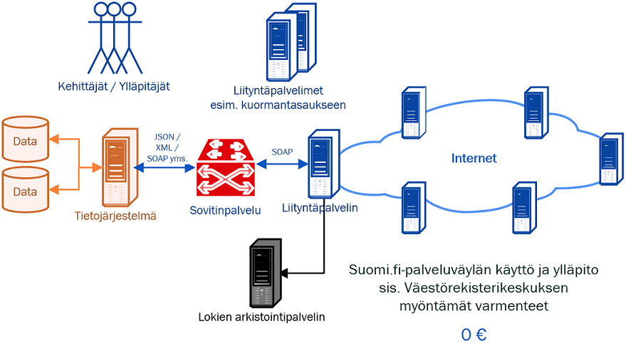

layout: true
name: sininen-palkki
class: sininen-palkki

---
layout: true
name: valkoinen
class: valkoinen

---
layout: true
name: header
class: center, middle, sininen

<!--DON'T TOUCH ABOVE THIS !!!!!! -->
---

template: header
# Suomi.fi-palveluväylän käyttöönotto

---

template: sininen-palkki

# Ennen liittymistä

- Perehdy runsaaseen aineistoon, mm. palvelukuvaukseen ja ohjeisiin (käyttöönotto ja ylläpito)
    - https://esuomi.fi/palveluntarjoajille/palveluvayla/   
- Youtube-video liityntäpalvelimen asentamisesta ja konfiguroinnista
    - https://www.youtube.com/watch?v=jHlr0jiOhUE&list=PLfKPQ6CBHVsx-c8YPSqZhBka0vjv2YvEh	
- Lähdekoodit https://github.com/ria-ee/X-Road ja tekninen dokumentaatio 
https://github.com/ria-ee/X-Road/tree/develop/doc
- Esimerkki siitä miten palveluväylän kautta hoidetut palvelukutsut toimivat
    - https://gofore.com/miten-viestit-liikkuvat-suomi-fi-palveluvaylassa/

---

template: sininen-palkki
class: split-55

# Näin liityt

.column[
1. Lähetä rekisteröintipyyntö esuomi.fi-sivulta löytyvällä lomakkeella (samalla hyväksyt käyttöehdot) 
    - FI-TEST ja FI-ympäristöt: Liitä lomakkeen mukaan täytetyt autentikointi- ja allekirjoitusvarmennehakemukset
2. Ylläpito hyväksyy liittymisen ja lähettää konfiguraatioankkurin - asennukset voidaan aloittaa
3. Asennusten jälkeen voit lähteä välittömästi testaamaan yhteyksiä ja palveluja
4. Palvelun tarjoajien: liityntäkatalogitietojen täyttäminen 
]
.column[]

---

template: sininen-palkki

# Liityntäkatalogi

- Hakemisto Suomi.fi-palveluväylän (FI-ympäristön) tarjottavista palveluista ja lista liittyneistä organisaatioista
- Tarkoituksena on helpottaa eri palveluntarjoajien palveluväyläympäristöön lisättyjen palveluiden löytämistä 
- Liittynyt organisaatio täyttää puuttuvat hallinnolliset kuvaukset, kun palvelu on lopulta saatu tuotantoympäristöön 
- Tekniset kuvaukset rajapinnoista haetaan katalogiin automaattisesti

---

template: sininen-palkki

# Liityntäkatalogi 

- Tuotantoympäristö (FI) https://liityntakatalogi.suomi.fi/ 
- Epävirallinen(!) testiympäristön katalogi (FI-TEST): https://liityntakatalogi.qa.suomi.fi/fi/ 

---

template: sininen-palkki

# Liittymisprosessi

- https://esuomi.fi/palveluntarjoajille/palveluvayla/liittyminen/
- Tuotantoympäristöön liittyminen edellyttää testiympäristöön liittymistä 
- Oman järjestelmän integraatiotyön suunnittelu (sovitinpalvelu) ja toteutus kannattaa myös aloittaa 
    - kutsuttava palvelu käyttö (consumer) / tarjottava palvelun rajapinta (provider)
- Liityntäpalvelimen asennukseen voi kulua jopa kuukausi (FI-TEST ja FI-ympäristöt)
    - Varmennepalvelun ruuhkat aiheuttavat viivettä 
- Kehitysympäristöön liittyminen nopeaa, koska sitä varten ei tarvitse täyttää virallisia varmennehakemuslomakkeita
    - Kevyt vaihtoehto, jos ei ole kiire tuotantoon siirtymisessä

---

template: sininen-palkki

# Mikä maksaa käyttöönotossa?

---
template: sininen-palkki

# Yhteystiedot
  
- palveluvayla@palveluvayla.fi 
    - Palveluväyläympäristöjen ylläpitäjät
    - Yhteyspiste liityntäpalvelin asennuksen ja konfiguroinnin aikana 
        - Yhteydenpitoa tarvitaan mm. rekisteröintien ja varmennekäsittelyjen aikana 

- kapa-asiakaspalvelu@vrk.fi 
    - Auttaa yleisissä hallinnollisissa asioissa
      - Auttaa etsimään vastaavat henkilöt mistä tahansa Suomi.fi-palvelusta
    - esim. KaPa-lain velvoittavuuskysymykset
        
---
template: header

# Kysymyksiä?
