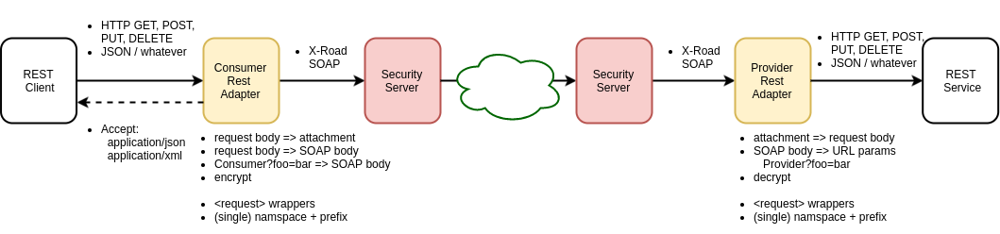
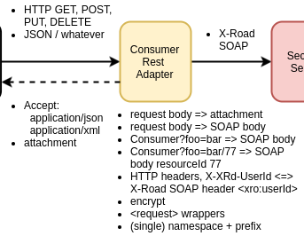
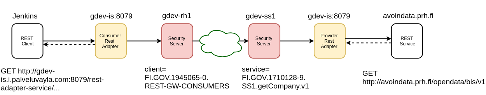

layout: true
name: sininen-palkki
class: sininen-palkki


---
layout: true
name: valkoinen
class: valkoinen


---
layout: true
name: header
class: center, middle, sininen


<!--DON'T TOUCH ABOVE THIS !!!!!! -->
---

template: header
# Rest Adapter

---

template: sininen-palkki
class: split-55

# Consumer ja/tai Provider adapter


---

template: sininen-palkki
class: split-55

# Tuetut toiminnot



---

template: sininen-palkki
class: split-55

# Accept:application/json

.column[]
.column[
```json
{

   "PaluuKoodi": "OK",
   "Teksti": "bar tekstiä",
   "TekstiLisatiedot": "Foo tekstiä",
   "Tarkenne": "Foo tarkenne"
}
```
]
---

template: sininen-palkki
class: split-55

# Accept:application/xml

.column[]
.column[
```xml
<toimija:HaeToimijaPFFResponse xmlns:toimija="http://vrk.fi/example/toimija">
   <toimija:PaluuKoodi>OK</toimija:PaluuKoodi>
   <toimija:Teksti>bar tekstiä</toimija:Teksti>
   <toimija:TekstiLisatiedot>Foo tekstiä</toimija:TekstiLisatiedot>
   <toimija:Tarkenne>Foo tarkenne</toimija:Tarkenne>
</toimija:HaeToimijaPFFResponse>

```
]

---

template: sininen-palkki
class: split-55

# URL parameterit ja resourceId
```shell
13.path=/parametersdemo/{resourceId}
13.verb=post
13.convertPost=true
```
POST -> http://host/rest-adapter-service/Consumer/parametersdemo/88?someparam=banana
```json
{ 
    "Tunniste": "foo1",
    "Tunniste2": "bar2",
}
```
```xml
<SOAP-ENV:Body>
    <foo:Foo xmlns:foo="http://vrk.fi/example/foo">
        <foo:resourceId>88</foo:resourceId>
        <foo:someparam>banana</foo:someparam>
        <foo:Tunniste2>bar2</foo:Tunniste2>
        <foo:Tunniste>foo1</foo:Tunniste>
    </foo:Foo>
</SOAP-ENV:Body>
```

---
template: sininen-palkki
class: split-55

# URL parameterit ja resourceId, 2
```shell
13.path=/parametersdemo/{resourceId}
13.verb=post
13.convertPost=false
```
POST -> http://host/rest-adapter-service/Consumer/parametersdemo/88?someparam=banana
```json
{ 
    "Tunniste": "foo1",
    "Tunniste2": "bar2",
}
```
```xml
<SOAP-ENV:Body>
    <foo:Foo xmlns:foo="http://vrk.fi/example/foo">
        <foo:resourceId>88</foo:resourceId>
        <foo:someparam>banana</foo:someparam>
        <foo:RESTGatewayRequestBody href="RESTGatewayRequestBody"/>
    </foo:Foo>
</SOAP-ENV:Body>
```

---
template: sininen-palkki
class: split-55

# URL parameterit ja resourceId, 3
```shell
13.path=/parametersdemo/{resourceId}
13.verb=get
```
GET -> http://host/rest-adapter-service/Consumer/parametersdemo/88?someparam=banana
```xml
<SOAP-ENV:Body>
    <foo:Foo xmlns:foo="http://vrk.fi/example/foo">
        <foo:resourceId>88</foo:resourceId>
        <foo:someparam>banana</foo:someparam>
    </foo:Foo>
</SOAP-ENV:Body>
```

---

template: sininen-palkki
class: split-55

# wrappers=false

.column[]
.column[
```xml
<SOAP-ENV:Body>
    <toimija:HaeToimijaPTF xmlns:toimija="http://vrk.fi/example/toimija">
        <toimija:Tunniste2>foobar2</toimija:Tunniste2>
        <toimija:Tunniste>foobar1</toimija:Tunniste>
    </toimija:HaeToimijaPTF>
</SOAP-ENV:Body>
```
]

---

template: sininen-palkki
class: split-55

# single namespace support

.column[]
.column[
```shell
1.namespace.serialize=http://vrk.fi/example/viesti
1.namespace.prefix.serialize=vies
1.namespace.deserialize=http://vrk.fi/example/viesti
```

```xml
<SOAP-ENV:Body>
    <vies:LisaaViesti xmlns:vies="http://vrk.fi/example/viesti">
        <vies:LahettajaTunniste>tunniste-123</vies:LahettajaTunniste>
        <vies:Viesti>
            <vies:ViestiKetjuTunniste>12345678</vies:ViestiKetjuTunniste>
            <vies:Otsikko>otsikko string</vies:Otsikko>
            <vies:Sisalto>sisältö string</vies:Sisalto>
            <vies:Liite>
                <vies:Otsikko>liite-otsikko-1</vies:Otsikko>
                <vies:Nimi>liite-1</vies:Nimi>
                <vies:MediaTyyppi>application/pdf</vies:MediaTyyppi>
            </vies:Liite>
            <vies:Liite>
                <vies:Otsikko>liite-otsikko-2</vies:Otsikko>
                <vies:Nimi>liite-2</vies:Nimi>
                <vies:MediaTyyppi>image/png</vies:MediaTyyppi>
            </vies:Liite>
        </vies:Viesti>
    </vies:LisaaViesti>
</SOAP-ENV:Body>
```
]

---

template: sininen-palkki
class: split-55

# multiple namespaces = impossible

.column[]
.column[
```xml
<SOAP-ENV:Body>
    <vies:LisaaViesti xmlns:vies="http://vrk.fi/example/viesti">
        <vies:LahettajaTunniste>tunniste-123</vies:LahettajaTunniste>
        <vies:Viesti>
            <vies:ViestiKetjuTunniste>12345678</vies:ViestiKetjuTunniste>
            <vies:Otsikko>otsikko string</vies:Otsikko>
            <vies:Sisalto>sisältö string</vies:Sisalto>
            <liite:Liite xmlns:liite="http://vrk.fi/example/liite">
                <liite:Otsikko>liite-otsikko-1</liite:Otsikko>
                <liite:Nimi>liite-1</vies:Nimi>
                <liite:MediaTyyppi>application/pdf</liite:MediaTyyppi>
            </liite:Liite>
            <liite:Liite xmlns:liite="http://vrk.fi/example/liite">
                <liite:Otsikko>liite-otsikko-2</liite:Otsikko>
                <liite:Nimi>liite-2</liite:Nimi>
                <liite:MediaTyyppi>image/png</liite:MediaTyyppi>
            </vies:Liite>
        </vies:Viesti>
    </vies:LisaaViesti>
</SOAP-ENV:Body>
```
]

---

template: sininen-palkki
class: split-55

# wrappers=false

.column[]
.column[
```xml
<SOAP-ENV:Body>
    <toimija:HaeToimijaPTF xmlns:toimija="http://vrk.fi/example/toimija">
        <toimija:Tunniste2>foobar2</toimija:Tunniste2>
        <toimija:Tunniste>foobar1</toimija:Tunniste>
    </toimija:HaeToimijaPTF>
</SOAP-ENV:Body>
```
]

---

template: sininen-palkki
class: split-55

# wrappers=true

.column[]
.column[
```xml
<SOAP-ENV:Body>
    <toimija:HaeToimijaPTF xmlns:toimija="http://vrk.fi/example/toimija">
        <toimija:request>
            <toimija:Tunniste2>foobar2</toimija:Tunniste2>
            <toimija:Tunniste>foobar1</toimija:Tunniste>
        </toimija:request>
    </toimija:HaeToimijaPTF>
</SOAP-ENV:Body>
```
]


---

template: sininen-palkki
class: split-55

# Automaattiset integraatiotestit gdevissä



- Jenkins
  - https://dev-jenkins.palveluvayla.com:8082/view/rest-adapter-service/job/rest-adapter-service-getCompany-gdev-rh1-ss1/
  - https://dev-jenkins.palveluvayla.com:8082/view/rest-adapter-service/job/rest-adapter-service-organizationlist-gdev-rh1-ss1/
- https://confluence.csc.fi/pages/viewpage.action?pageId=66685001

---
