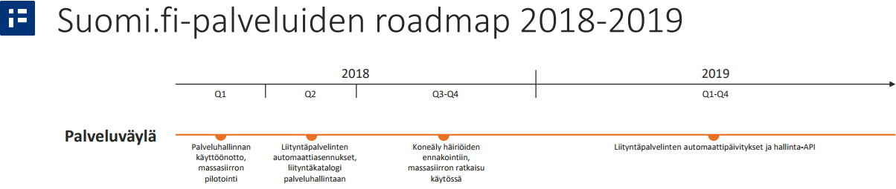

layout: true
name: sininen-palkki
class: sininen-palkki

---
layout: true
name: valkoinen
class: valkoinen

---
layout: true
name: header
class: center, middle, sininen

<!--DON'T TOUCH ABOVE THIS !!!!!! -->
---

template: header
# Suomi.fi-palveluväylä
.center[Roadmap]
  
---

template: sininen-palkki

# Ylemmän tason roadmap

Nordic Institute for Interoperatibility Solutions (NIIS) ottaa jatkossa enemmän vastuuta X-Roadin ydinominaisuuksien jatkokehittämisestä
- NIIS websivu: [www.niis.org](https://www.niis.org)  

VRK on julkistanut Suomi.fi-palvelujen alustavan suunnitelman vuosille 2018-2019
- [Suomi.fi kehityssuunnitelma](https://esuomi.fi/?mdocs-file=18065&mdocs-url=false)  
    + Palveluväylään liittyviä kehityskohteita:
    
.center[]

---

template: sininen-palkki

# Federointi

Tarkoittaa X-Road ympäristön luottamusverkon laajentamista toiseen X-Road ympäristöön ts. tuki sanomienvälitykseen Suomi.fi-palveluväylän ja Viron X-tee –ympäristön välillä 
- FI-DEV ja FI-TEST väylät on liitetty yhteen, FI (tuotanto)-ympäristössä on tekninen valmius avata federointin heti kun ensimmäiset hyödyntäjät haluavat sitä käyttää
- Liittyjän kannalta huomioitava palomuuriavaukset:
    + Viron "vastapuolen" konfigurointipalvelimen IP-osoitteeseen:
        * Portit 5500 ja 5577  
    + Viron keskuskonfiguraatiota jakavan (Suomen keskusympäristön) konfigurointipalvelimen IP-osoitteeseen:
        * 193.166.187.200 porttiin 80
- Federointi on jatkossa oletusarvoisesti pois käytöstä yksittäisillä palveluväylään liitetyillä liityntäpalvelimilla
    + Konfigurointi: [Security Server User Guide - Federation](https://github.com/ria-ee/X-Road/blob/develop/doc/Manuals/ug-ss_x-road_6_security_server_user_guide.md#18-federation)

---

template: sininen-palkki

# Parannuksia HA-tukeen

- Halutaan toipua nopeammin tietyntyyppisistä verkko-ongelmista (6.9 -versiossa)
- Selvitetään round-robin -tekniikan käyttöä (Arvio H2/2017)
    + Tällä hetkellä työn alla Suomen kehitystiimissä
- Lisätietoa: 
    + https://github.com/vrk-kpa/xroad-joint-development/issues/58 

---

template: sininen-palkki

# Alustamonitoroinnin tietojen keruu

Alustamonitoroinnin tietojen keruujärjestelmä käyttöön
- Aluksi FI-TEST
    + Käyttöön lähiaikoina (Q4/2017)
- Myöhemmin ensi vuoden alussa FI (tuotanto)-ympäristö.
- Kerätään tietoja liityntäpalvelimilta mm. X-Road ohjelmistoversio, alustapalvelimen käyttöjärjestelmän versionumero ja liityntäpalvelimen varmenteiden voimassaoloajat
    + Käytetään ylläpidollisiin tarkoituksiin esim. varmenteiden vanheneminen
    + Kerättyjä tietoa ei luovuteta eteenpäin kolmansille osapuolille ja niitä käsitellään luottamuksellisesti
- Lisätietoja: [X-Road Environmental Monitoring](https://github.com/ria-ee/X-Road/blob/develop/doc/EnvironmentalMonitoring/Monitoring-architecture.md) 

---

template: sininen-palkki

# Rest Adapter Service

REST/JSON <-> SOAP -sovitinpalvelun
- Rest Adapter Service -sovitinpalvelu mahdollistaa REST/JSON <-> SOAP -sanomamuunnosten perustoiminnallisuuden käyttämisen liityntäpalvelimilla.
- Asentamista helpotetaan tuomalla sovitinpalvelun jakelupaketit samaan repositorioon kuin muutkin Palveluväylän jakelupaketit (sekä Ubuntu- että RHEL -jakelut).
- Liityntäpalvelimen omistaja voi halutessaan ottaa sovitinpalvelun käyttöön
- Tutustu sovitinpalveluun: [Rest Adapter Service](https://github.com/vrk-kpa/REST-adapter-service)
    + Avointa lähdekoodia
- Työn alla, paketointi & ohjeet tulossa lähiaikoina valmiiksi (Q4/2017)

---

template: sininen-palkki

# Väylän käyttöstatistiikkatietojen keruu

Käyttöstatistiikkatietojen tietojen keruujärjestelmän tekeminen työn alle
- Työ aloitettu
    + Käyttöön 2018
- Kerätään tietoja liityntäpalvelimilta mm. eri palveluiden kutsumääristä, viestin määristä ja vasteajoista.
    + Käytetään tilastollisiin tarkoituksiin
    + Kerättyjä tietoa ei luovuteta eteenpäin kolmansille osapuolille ja niitä käsitellään luottamuksellisesti
- Lisätietoja: [X-Road Operational Monitoring](https://github.com/ria-ee/X-Road/blob/develop/doc/OperationalMonitoring/Architecture/arc-opmond_x-road_operational_monitoring_daemon_architecture_Y-1096-1.md) 

---

template: sininen-palkki

# X-Road käyttökokemuksen pantaminen

Erilaisia toimia tulossa X-Roadin käyttö- ja kehittäjäkokemuksen parantamiseksi:
- X-Roadin ajaminen Docker kontissa
- X-Road tietoisuuden levittäminen
    + tiedon jakaminen avoimemmin
    + tiedon määrän lisääminen
    + yksi NIIS:n tavoitteista
- Palveluväylä meetup loppuvuodesta 2017 

---

template: sininen-palkki

# X-Road core (FIN + EST) roadmap

Suomen ja Viron yhteisen X-Road kehityksen roadmap:
- [X-Road roadmap](https://github.com/vrk-kpa/xroad-joint-development/blob/master/ROADMAP.md) 

---

template: header
# Kysymyksiä?
