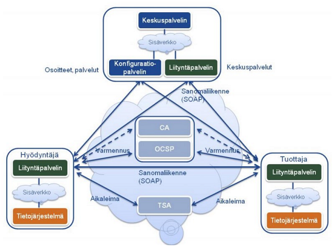
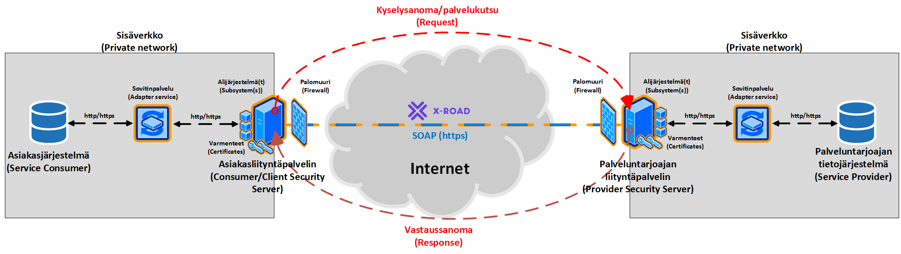
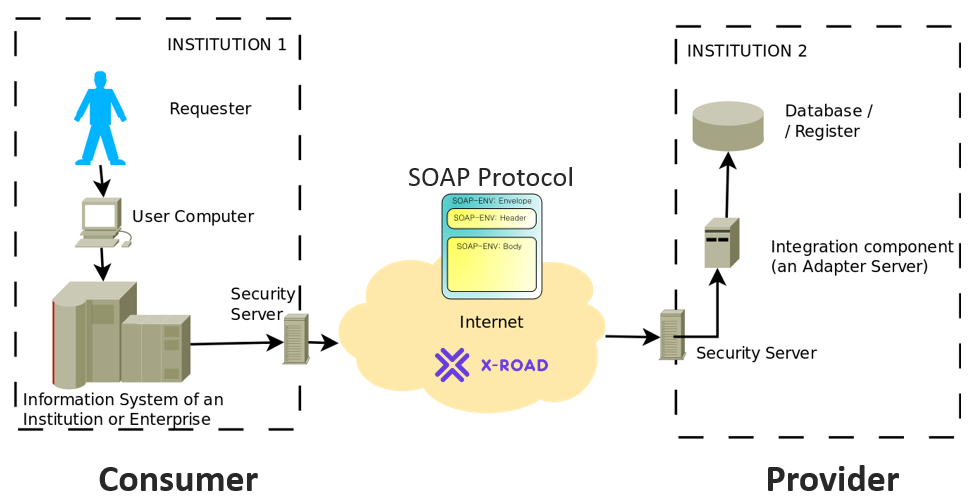
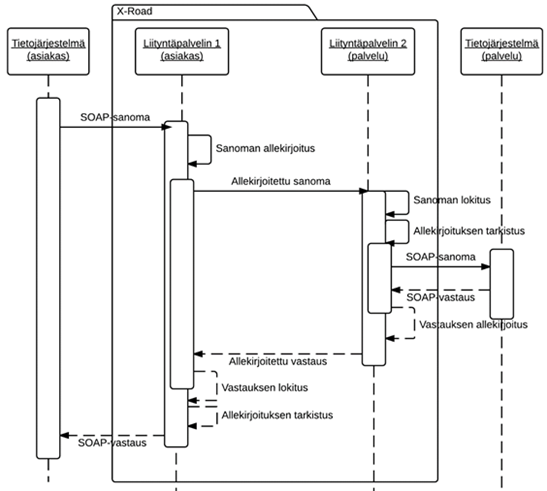

layout: true
name: sininen-palkki
class: sininen-palkki

---

layout: true
name: valkoinen
class: valkoinen

---
layout: true
name: header
class: center, middle, sininen

<!--DON'T TOUCH ABOVE THIS !!!!!! -->
---

template: header
# Suomi.fi-palveluväylän yleisesittely
.center[Toimintaperiaatteet, operointi ja ylläpito]

---

template: sininen-palkki

# Suomi.fi-palveluväylä

- Tiedonvälityskokonaisuus, joka toimii viestiväylänä siihen liitettyjen palveluiden ja tietovarantojen välillä
- Käyttövelvollisuus koskee julkista-, käyttöoikeus yksityistä sektoria. 
- Palveluväylän kautta tarjottavat tiedot joko sopimuksenvaraisia hyödyntäjän ja tarjoajan välillä, tai vapaasti kaikkien liittyneiden käytettävissä. 
   
---

template: sininen-palkki

# Suomi.fi-palveluväylä

- Perustuu Viron X-Road ratkaisuun
- Kehitystyö jatkuu tiiviissä yhteistyössä virolaisten kanssa
- Tiedonvälityskokonaisuus, joka toimii viestiväylänä siihen liitettyjen palveluiden ja tietovarantojen välillä
- Tarjoaa keskitetyt palvelut sanomaliikenteen mahdollistamiseksi liityntäpalvelimien välillä
    - Osoitteiden hallinta ja reititys
    - Käyttöoikeuksien hallinta
    - Salaus 
    - Aikaleimat
    - Lokitus
    - Federointi Viron ympäristöön (tällä hetkellä FI-DEV ja FI-TEST, FI valmius)
    - Tuki asennusvaiheessa sekä ongelmatilanteissa

---

template: sininen-palkki

# Suomi.fi-palveluväylä (jatkoa)

- Palvelun omistaa Väestörekisterikeskus
Suomi.fi-palveluväylän kehitys- ja ylläpito on  VRK:n lakisääteinen tehtävä
- Ympäristöjen (FI-DEV, FI-TEST ja FI) hallinnointi tapahtuu yhdessä CSC:n kanssa
    + Palveluväylän keskusympäristön ylläpito sekä tukipalvelut ovat CSC:n operoimia
- Hyödyt syntyvät väylään kytketyistä tiedoista ja palveluista, ei väylästä itsestään
- Palveluväylän arvo on sen muodostamassa standardoidussa tietojen vaihdon ratkaisumallissa
- Mahdollistaa tässä vaiheessa Vahti ST4-tason tiedonvaihdon (ST3-taso pyritään mahdollistamaan lähitulevaisuudessa)
- Nordic Institute for Interoperatibility Solutions (NIIS) ottaa jatkossa enemmän vastuuta X-Roadin ydinominaisuuksien jatkokehittämisestä

---

template: sininen-palkki

# Palveluväylän komponentit

Palveluväylä koostuu
- Keskusinfrasta, johon kuluu
    - Keskuspalvelin (CS = Central Server)
    - Varmennepalvelu (CA = Certificate Authority,  OCSP = Online Certificate Status Protocol
    - Aikaleimapalvelu (TSA = Time Stamping Authority)
- Liityntäpalvelimista (SS = Security Server)
- Väylään kytketyistä tietojärjestelmistä (IS = Information System)

---

template: sininen-palkki

# Palveluväylän komponentit (jatkoa)

.center[]

---

template: sininen-palkki

# Palveluväylän kokonaiskuva

---

template: sininen-palkki

# Viestin välitys

.right[]

---

template: sininen-palkki

# Asiakas – palveluntarjoaja malli

.center[]

---

template: sininen-palkki

# Varmenteet

- Palveluväylään liitetyllä liityntäpalvelimella tulee olla voimassa olevat varmenteet, jotta se on toimintakuntoinen
    - Palvelinvarmenne todentaa palvelimen
    - Allekirjoitusvarmenne todentaa viestin lähettäjän
- Liityntäpalvelin huolehtii OCSP-vastausten hakemisesta omille varmenteilleen varmennepalvelulta
- Viestin välitys ei toimi mikäli liityntäpalvelimella ei ole tarjota voimassa olevia OCSP-vastauksia

---

template: sininen-palkki

# Termejä

**Member**
- väylään liittynyt organisaatio
- samaan liityntäpalvelimeen voi olla liitetty useita membereitä. Kuitenkin yksi niistä on liityntäpalvelimen omistaja.

**Subsystem**
- alijärjestelmä
- tapa jakaa organisaation palveluita ja käyttöoikeuksia pienempiin hallinnoitaviin yksiköihin
- Suomessa aina pakollinen - viestit lähtevät ja saapuvat alijärjestelmälle/-ltä

---

template: sininen-palkki

# Termejä (jatkoa)

**Client**
- termi liityntäpalvelimeen kytketylle toimijalle
- **_consumer_**  client lähettää kutsuja muualla oleviin palveluihin
- **_provider_**  client tarjoaa palveluja muille

**Service**
- väylään liitetty SOAP palvelu

---

template: sininen-palkki

# Liittyvän organisaation vastuulla

- Suomi.fi-palveluväylään kytkettyjen taustajärjestelmien ylläpito
- Kytkettävät palvelut täyttävät määritellyt tekniset rajapintavaatimukset
    - Sovitinpalvelun toteutus
- Asentaa ja konfiguroida liityntäpalvelin 
- Ylläpitää liityntäpalvelin käyttökuntoisena
    - Mahdolliset SLA-sopimukset osapuolten kanssa

---

template: sininen-palkki

# Ylläpidon ulkoistaminen

- Liityntäpalvelimen operointi ja ylläpitotyö voidaan toki ulkoistaa
    - Valtion toimijoille Valtori 
    - Kuntatoimijoilla esim. maakunnalliset ICT-yhtiöt
    - Mahdolliset (yksityiset) toimijat
- Keskitetyillä toimijoilla tärkeä rooli yhteiskäyttöisyyden mahdollistajana
    - Kaikki ei välttämättä tarvitse omaa liityntäpalvelinta  

---

template: sininen-palkki

# Liityntäpalvelimen operointia

- Alijärjestelmien lisäämiset
- Avainten ja varmenteiden hallinta
- Päättää siitä kuka saa kutsua organisaation liityntäpalvelinta ja siihen liitettyjä palveluja
    - Palomuuriavaukset
    - ACL (Access Control List), kuka voi käyttää alijärjestelmää (palvelua)
- Yhteyksien testaamiset
- Virhetilanteiden käsittelyä

---

template: sininen-palkki

# Liityntäpalvelimen ylläpitoa

- Versiopäivitykset
- Varmuuskopioinnit ja palauttamiset
- Arkistoitujen viestilokien / tekstilokien hallinta
    - Arkistointi 
    - Poistaminen

- Muutokset palvelinkokoonpanossa
    - Lisäkapasiteettia
    - Ulkoisen kuormantasaajan käyttöönotto
- Konfiguraatioparametrien säätäminen 

---

template: sininen-palkki

# Operointi- ja ylläpitotoimintoja

- **Hallintakäyttöliittymästä:** 
    - Konfiguraatioankkuri
    - PIN-koodin syöttäminen (uutta: Autologin komponentti)
- Varmenteet
- Varmuuskopiointi ja palauttaminen
- Diagnostiikka
- Alijärjestelmien ja palveluiden lisääminen 

---

template: sininen-palkki

# Operointi- ja ylläpitotoimintoja (jatkoa)

- **Muilla tavoin:**
    - Palomuuriavaukset
    - Prosessien valvonta
    - Konfiguraatioparametrit
    - Levytilan vapauttaminen

---

template: sininen-palkki

# Palvelinkapasiteetti

- Suosituksia minimi palvelinkokoonpanoille erilaisissa kuormituksissa 
esuomi.fi => Tekniset vaatimukset
[Liityntäpalvelimen tekniset vaatimukset](https://esuomi.fi/palveluntarjoajille/palveluvayla/tekninen-aineisto/hyva-tietaa/liityntapalvelimen-tekniset-vaatimukset/)
- Riippuu lopulta käytettävästä palvelusta ja sen käyttäjämääristä millaista alusta kannattaa valita
    - Kysely- ja vastaussanomakoot
    - Käyttäjien (kyselyiden) määrä 
- Huomioon otettava niiden myötä lokiarkistoinnit (konfiguraatioparametreillä), jottei se häiritsisi muuta toimintaa 

---
template: sininen-palkki

# Yhteystiedot

- kapa-asiakaspalvelu@vrk.fi 
    - Auttaa yleisissä hallinnollisissa asioissa
      - Auttaa etsimään vastaavat henkilöt mistä tahansa Suomi.fi-palvelusta
    - esim. KaPa-lain velvoittavuuskysymykset
    
- palveluvayla@palveluvayla.fi 
    - Palveluväyläympäristöjen ylläpitäjät
    - Yhteyspiste liityntäpalvelin asennuksen ja konfiguroinnin aikana 
        - Yhteydenpitoa tarvitaan mm. rekisteröintien ja varmennekäsittelyjen aikana 
        
---
template: header

# Kysymyksiä?
